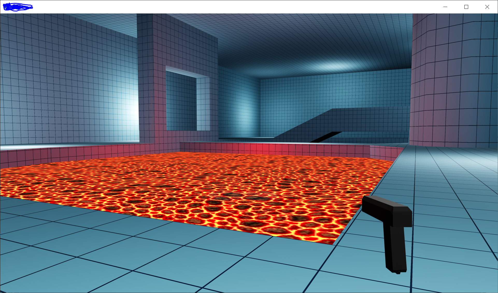

# Real Time Physically Based Renderer with an IBL Pipeline. 

## Overview

This an OpenGL project I created during High School that showcases an Image Based Lighting (IBL) and Physically Based Rendering engine using the Cook Torrance BRDF implementation following closely LearnOpengl and Sébastien Lagarde's "Moving Frostbite to PBR" paper from SIGGRAPH 2014. Also features a Bullet Physics integration that is used to simulate a rigid body simulation of the created entities in the scene. Post processor which can be used to create complex post-processing effects, however here I only use it to tone map the render to ACES colorspace and a terrain generator/renderer.
Finally, I created a small sample game to showcase all the features of the engine.

Other Additions - 

## Terrain Renderer

Dynamically generating vertex points at runtime, the terrain renderer creates a dynamic landscape with texture and normal coordinates calculated on the fly. Utilizing Perlin noise, Simplex noise, and other noise functions, the terrain's elevation is crafted, adding details and dimension.

## Particle System 

A simple particle system that can animate particle scale, rotation, and translation, with different kinds of emitters.  

## Game Showcase

- **Dynamic Player Controller:** The player is equipped with a dynamic controller, offering smooth and responsive movement.
- **Weapon System:** A simple yet effective weapon system utilizes the Bullet Physics engine to shoot projectiles, and the particle system adds visual flair to the shooting experience.
- **Level Design:** The game environment is loaded through the glTF format, showcasing the engine's ability to handle complex 3D models.
- **Shader Techniques:** The level is shaded using point lights, emphasizing realistic lighting effects. Image Based Lighting (IBL) is seamlessly integrated, leveraging an HDR skybox to enhance the overall visual experience.

## Disclaimer

I made this project during High School when I was still learning to code, this project's codebase leaned heavily towards very naive Java-like practices, lacking adherence to proper C++ standards. Raw pointers were used extensively without due consideration for memory management, resembling Java objects rather than proper C++ usage. Fundamental principles such as polymorphism and inheritance were not adequately implemented, if at all.
This inclination towards Java-style programming can be attributed to my concurrent learning of Java during that period, inadvertently influencing my approach to C++.
It's essential to note that this code lacks recommended and advanced programming practices, potentially leading to memory leaks and unoptimized code which may be messy.

Since this project, I've significantly improved my coding practices in the ongoing iterations of such engines. The updated version adheres more closely to industry standards in C++ and programming in general, minimizes memory leaks, and implements better practices related to abstraction.

Thank you for your understanding, and feel free to explore the project to witness the progression in coding practices over time.
